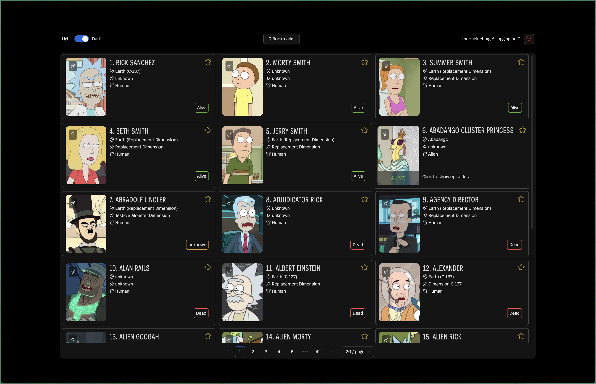

# Rick & Morty Cast & Crew

## About This Project

This project is a full-stack application designed to showcase my ability to integrate various technologies into a cohesive and functional system. It demonstrates proficiency in several areas including front-end development with React, state management with React Context, and back-end development with Apollo Server and Prisma.

The application is a character viewer, allowing users to browse, bookmark, and view detailed information about different characters. It uses a GraphQL API to fetch data, and implements user authentication and session management.

## Inspiration

This project was inspired by one of the coding interviews I had. I found the task interesting and thought it would be a great idea to share it with the community. If you're curious about the entity that proposed such a task, feel free to ping me. I believe in the power of shared knowledge and I'm happy to contribute to the collective learning of the open source community.

## How to run the project

I took the extra step of shipping a dockerized application and a docker-compose file to run the application. To run the application, you need to have docker and docker-compose installed on your machine.



Install the applications first by running the following command from the root folder, don't worry it will install things for the monorepo:

```bash
yarn install
```

Do not forget to create the `.env` following the `.env.example` file in the backend folder `packages/backend` and add the corresponding environment variables:

```bash
JWT_SECRET=<hakuna_matata>
```

Afterwards, simply run the following command to start the application:

```bash
docker-compose up
```

and the application will be available at `http://localhost:3000` but we need the migrations to be shipped. Thus, proceed with the following command to run the migrations only when the database is completely up and running:

```bash
yarn db:migrate
```

## Ethics

Please be mindful when using this project. While it's available for learning and personal use, it's not intended to be submitted for coding tasks or challenges without significant modifications and original contributions. Always respect the work of others and avoid representing it as your own.

## 🤝 Contributing

We welcome contributions! Feel free to submit a pull request.

## Author

This project is showcased and developed by [ylkhayat](https://github.com/ylkhayat). You can visit my page for more projects.

## 📜 License

This project is licensed under the ISC License.
